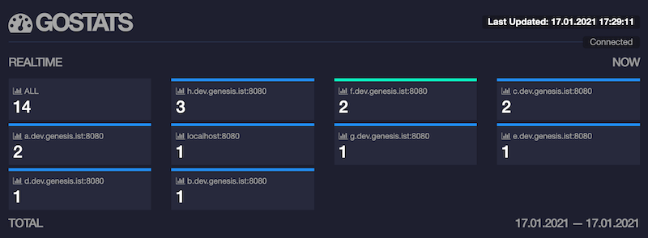
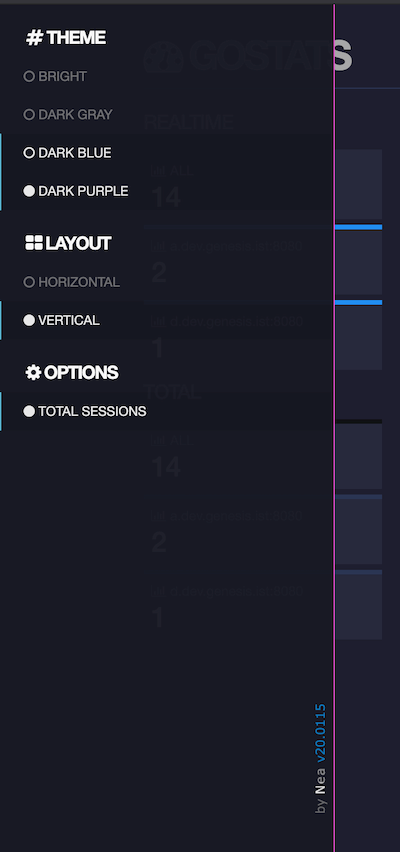

#gostats

Online visitors monitoring for multiple websites with nice and realtime dashboard

|   .   | features                     |
| :---: | ---------------------------- |
|   ✅   | backed redis                 |
|   ✅   | uses sessionStorage          |
|   ✅   | configurable parameters      |
|   ✅   | realtime dashboard with auth |
|   ✅   | container ready              |
|  ⬜️   | ...                          |

### integration
```
<script async id="gos" src="https://[gostats.server.address]/update"></script>
```

### docker support
```
$ docker run --name redis -d -p 6379:6379 redis:alpine 
$ docker run --rm --name gostats --link redis \
    -e REDIS_URL="redis:6379" -p 8000:8000 neaplus/gostats
```
[gostats docker hub](https://hub.docker.com/r/neaplus/gostats)

### development
```
Make sure you have go installed, then install gow package
$ go get -u github.com/mitranim/gow

then run this for:
Dev Server on (http://localhost:8000/)
$ ./_dev.sh

Containerization
$ docker build -t gostats .
```

##### KNOWN ISSUES
NONE

##### TODOS
- optional support for cookies
- docker-compose file
- browser connection monitoring / reconnection
- clickable boxes links to domain
- selectable boxes to highlight domain
- a-z / 0-9 sorting option
- cache control for stats.js
- bundle build scripts
- view options for grid cell (display, hide, etc)

#
## Show me Screenshots




